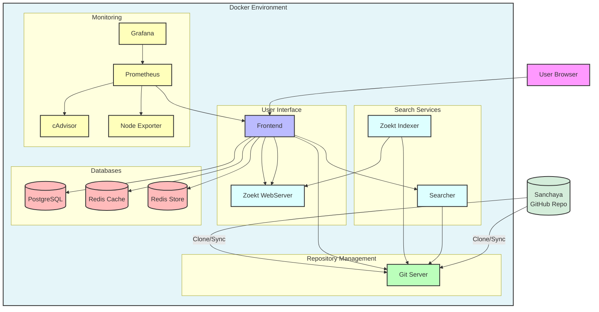
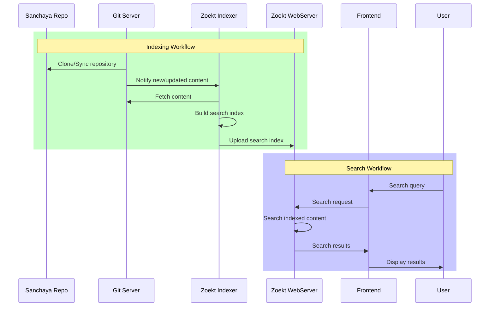

# Sourcegraph Docker Compose Deployment

This repository contains Docker Compose configuration for deploying Sourcegraph, a code intelligence ### External Access

By default, the following ports are exposed:

- Port 7080: HTTP access
- Port 443: HTTPS access (disabled by default)arch platform.

## Purpose

This Sourcegraph deployment is specifically configured to enable efficient searching and browsing of the Sanchaya repository, which contains a vast collection of Unicode text files with Indic content. Key features include:

- Full-text search capabilities for Unicode Indic scripts
- Fast indexing and searching of text content
- Easy navigation through Indic language content
- Support for multiple Indic scripts and encodings
- Advanced search features like regular expressions and filters

This setup allows researchers, scholars, and enthusiasts to quickly search and access the rich collection of Indic texts maintained in the Sanchaya repository.

## System Requirements

- Docker Engine
- Docker Compose v2.4+
- Minimum 16GB RAM
- Minimum 200GB disk space

## Quick Start

1. Clone this repository
2. Start the deployment:

```sh
docker-compose up -d
```

3. Access Sourcegraph at http://localhost:7080

## Architecture

The deployment consists of the following main services:

- Frontend (`sourcegraph-frontend-0`): Web application UI
- Search (`searcher-0`, `zoekt-indexserver-0`, `zoekt-webserver-0`): Code search functionality  
- Git backend (`gitserver-0`): Repository management
- Databases:
  - PostgreSQL (`pgsql`): Primary database
  - Redis (`redis-cache`, `redis-store`): Caching layer
- Monitoring:
  - Grafana (`grafana`): Metrics visualization
  - Prometheus (`prometheus`): Metrics collection
  - cAdvisor (`cadvisor`): Container metrics
  - Node Exporter (`node-exporter`): Host metrics

### Architecture Diagram



### Workflow Diagrams



## Configuration

### External Access

By default, the following ports are exposed:

- Port 7080: HTTP access 
- Port 443: HTTPS access (disabled by default)
- Port 3370: Grafana dashboard
- Port 9090: Prometheus metrics

### HTTPS Configuration

To enable HTTPS:

1. Comment out the HTTP Caddyfile mount in the `caddy` service
2. Uncomment one of the HTTPS configuration options:
   - Let's Encrypt (staging/production)
   - Custom certificates

## Storage

Persistent volumes are configured for:

- Git repositories
- Search indexes
- Databases
- Cache data
- Monitoring data

## Monitoring 

Access monitoring dashboards at:

- Grafana: http://localhost:3370
- Prometheus: http://localhost:9090

## Directory Structure and Files

This repository is organized as follows:

### Root Directory

- `docker-compose.yaml`: Main Docker Compose configuration file that defines all services
- `docker-compose.override.yml`: Contains customizations and overrides for the main compose file
- `docker-compose.resource.yml`: Resource allocation and constraints for Docker services
- `sourcegraph-deploy.tar.gz`: Compressed archive of the deployment for distribution
- `.env`, `.env.local`, `.env.gcp`: Environment variable files for different deployment scenarios
- `deploy-to-gcp.sh`: Shell script for deploying Sourcegraph to Google Cloud Platform
- `cleanup-gcp.sh`: Script to remove resources from Google Cloud Platform

### Caddy Directory (`caddy/`)

Contains configurations for the Caddy web server that handles HTTP/HTTPS traffic:

- `builtins/http.Caddyfile`: HTTP configuration for Caddy web server

### Configuration Directory (`config/`)

Contains application-specific configurations:

- `site-config.json`: Core configuration for the Sourcegraph instance

### Purpose of Key Files

- **Docker Compose Files**: Define the multi-container application setup
  - `docker-compose.yaml`: Primary configuration
  - `docker-compose.override.yml`: Custom settings that override defaults
  - `docker-compose.resource.yml`: Resource allocation settings
  
- **Environment Files**:
  - `.env`: Default environment variables
  - `.env.local`: Local development overrides
  - `.env.gcp`: Google Cloud Platform specific settings
  
- **Scripts**:
  - `deploy-to-gcp.sh`: Automates deployment to Google Cloud Platform
  - `cleanup-gcp.sh`: Removes cloud resources when no longer needed
  
- **Configuration Files**:
  - `caddy/builtins/http.Caddyfile`: Controls how HTTP traffic is handled
  - `config/site-config.json`: Configures Sourcegraph application behavior

## Additional Documentation

For more detailed configuration and operation instructions, see:

- [Sourcegraph Docs](https://docs.sourcegraph.com)
- [Docker Compose Deployment Docs](https://docs.sourcegraph.com/admin/install/docker-compose)

## GitHub Integration and Deployment Workflow

This section outlines how to set up a GitHub-based workflow for managing and deploying your Sourcegraph instance.

### Setting Up the GitHub Repository

1. Initialize the local repository:
   ```sh
   git init
   ```

2. Create a `.gitignore` file:
   ```sh
   cat > .gitignore << EOF
   # Environment files with sensitive data
   .env.local
   
   # Data volumes and runtime files
   volumes/
   *.log
   
   # Temporary files
   .DS_Store
   *.swp
   *~
   
   # Compressed archives
   *.tar.gz
   EOF
   ```

3. Create and commit your initial code:
   ```sh
   git add .
   git commit -m "Initial commit of Sourcegraph deployment configuration"
   ```

4. Create a new repository on GitHub
   - Go to https://github.com/new
   - Name your repository (e.g., "sourcegraph-deployment")
   - Choose public or private visibility as needed
   - Do not initialize with README, .gitignore, or license

5. Link and push to the remote repository:
   ```sh
   git remote add origin https://github.com/YOUR-USERNAME/sourcegraph-deployment.git
   git branch -M main
   git push -u origin main
   ```

### Deployment Workflow

#### Option 1: Pull-Based Deployment (Recommended)

1. Set up SSH keys on your GCP instance for GitHub access:
   ```sh
   # On GCP instance
   ssh-keygen -t ed25519 -C "your-email@example.com"
   cat ~/.ssh/id_ed25519.pub
   # Add this key to your GitHub account
   ```

2. On your GCP instance, clone the repository:
   ```sh
   git clone https://github.com/YOUR-USERNAME/sourcegraph-deployment.git
   cd sourcegraph-deployment
   ```

3. Create a deployment script on GCP (deploy.sh):
   ```sh
   #!/bin/bash
   set -e
   
   # Navigate to the repository
   cd ~/sourcegraph-deployment
   
   # Pull latest changes
   git pull
   
   # Deploy using docker-compose
   docker-compose down
   docker-compose up -d
   
   echo "Deployment completed successfully."
   ```

4. Make the script executable:
   ```sh
   chmod +x deploy.sh
   ```

5. For future deployments:
   - Push changes to GitHub from your local machine
   - SSH into GCP and run ./deploy.sh

#### Option 2: GitHub Actions for Automated Deployment

1. Set up GitHub Secrets for GCP authentication:
   - GCP_PROJECT_ID
   - GCP_SA_KEY (Base64-encoded service account key)
   - GCP_INSTANCE_NAME
   - GCP_ZONE

2. Create a GitHub Actions workflow file `.github/workflows/deploy.yml`:
   ```yaml
   name: Deploy to GCP
   
   on:
     push:
       branches:
         - main
       paths-ignore:
         - '**.md'
   
   jobs:
     deploy:
       runs-on: ubuntu-latest
       steps:
         - uses: actions/checkout@v3
         
         - name: Set up Cloud SDK
           uses: google-github-actions/setup-gcloud@v0
           with:
             project_id: ${{ secrets.GCP_PROJECT_ID }}
             service_account_key: ${{ secrets.GCP_SA_KEY }}
             export_default_credentials: true
         
         - name: Deploy to GCP instance
           run: |
             gcloud compute ssh ${{ secrets.GCP_INSTANCE_NAME }} --zone ${{ secrets.GCP_ZONE }} --command="cd ~/sourcegraph-deployment && git pull && docker-compose down && docker-compose up -d"
   ```

### Best Practices

1. **Environment Variables**: 
   - Use `.env` for template/default values
   - Create `.env.local` on each environment for local overrides (added to .gitignore)

2. **Branch Protection**:
   - Enable branch protection on main
   - Require pull request reviews before merging

3. **Documentation**:
   - Document deployment process
   - Include troubleshooting guidance

4. **Versioning**:
   - Tag stable releases with semantic versioning
   - Document changes in each version

By implementing this workflow, you'll have a more manageable, trackable, and collaborative approach to deploying your Sourcegraph instance to GCP.
