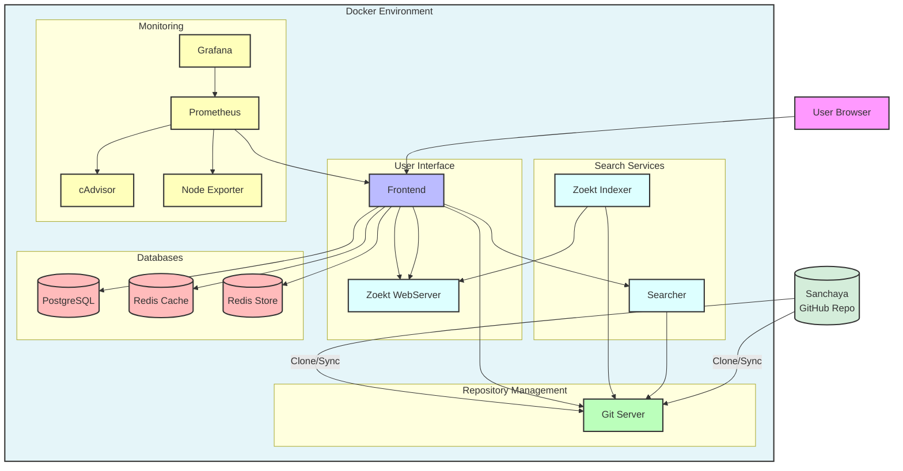
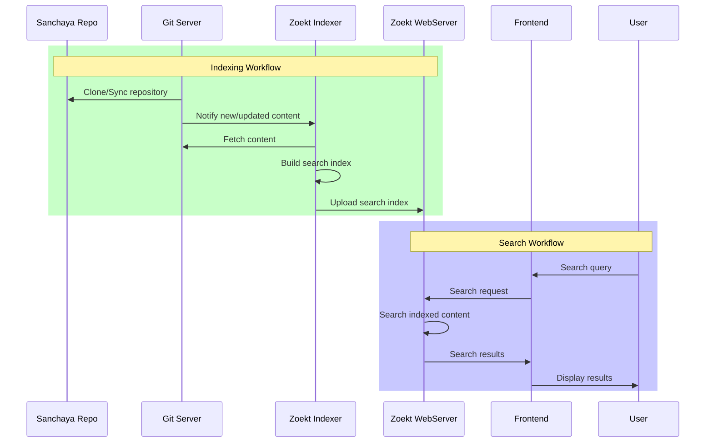

# Sanchaya Sourcegraph 

This Sanchaya Sourcegraph deployment is specifically configured to enable efficient searching and browsing of the Sanchaya repository, which contains a vast collection of Unicode text files with Indic content. Key features include:

- Full-text search capabilities for Unicode Indic scripts
- Fast indexing and searching of text content
- Easy navigation through Indic language content
- Support for multiple Indic scripts and encodings
- Advanced search features like regular expressions and filters

This setup allows researchers, scholars, and enthusiasts to quickly search and access the rich collection of Indic texts maintained in the Sanchaya repository.

## System Requirements

- Docker Engine
- Docker Compose v2.4+
- Minimum 16GB RAM
- Minimum 100GB disk space

## Getting Started

### Local Mac Development

Ensure you have Docker Desktop installed on your macOS machine. 

1. Clone this repository https://github.com/suchakr/sanchaya-sourcegraph.git
2. Use the Mac-specific script which creates required directories and starts containers:

```sh
# Make the script executable
chmod +x mac_up.sh

# Start Sourcegraph
./mac_up.sh
```

3. Access Sourcegraph at http://localhost:7080

### GCP Deployment Manually

Ensure you have Docker Engine and Docker Compose installed on your GCP VM instance. This deployment is optimized for production use on Google Cloud Platform. 

1. Clone this repository
2. Make sure `/mnt/docker-data` exists (created by `03_sourcegraph_prep.sh`)
3. Run the script to start Sourcegraph (with HTTP or HTTPS):

```sh
# Start with HTTP (default) - for testing
./04_sourcegraph_start.sh

# Start with HTTPS - for production
./04_sourcegraph_start.sh https
```

4. Access Sourcegraph at:
   - HTTP mode: http://YOUR_VM_EXTERNAL_IP:7080
   - HTTPS mode: https://YOUR_VM_EXTERNAL_IP

5. To stop the deployment, run:

```sh
# Stop while preserving data volumes
./05_sourcegraph_stop.sh

# Stop and remove all data volumes
./05_sourcegraph_stop.sh -v
```

or to remove volumes:

```sh
docker compose down -v # to remove volumes
```

### GCP Deployment using Scripts

> **Note**: Before running these scripts, ensure you have the Google Cloud SDK installed and configured with appropriate permissions.

These scripts are designed to be run in order to set up a Sourcegraph instance on GCP. These scripts are invoked from your development machine and will create a GCP VM instance, install Docker, set up persistent storage, and start Sourcegraph services.

1. **`00_allocate_gcp.sh`**  
   Creates a new GCP VM instance with the necessary specifications (CPU, memory, disk).

2. **`01_docker_install.sh`**  
   Installs Docker and Docker Compose on the GCP VM instance.

3. **`02_disk_setup.sh`**  
   Formats and mounts additional persistent disk storage for Docker volumes.

4. **`03_sourcegraph_prep.sh`**  
   Prepares the directory structure for Sourcegraph data, setting up `/mnt/docker-data` paths.

5. **`04_sourcegraph_start.sh`**  
   Starts the Sourcegraph services using Docker Compose with GCP-specific settings.

#### All-in-One Deployment

For convenience, an all-in-one deployment script is provided:

- **`oneshot_deploy_gcp.sh`**  
   Executes all the above scripts in sequence for a complete deployment.

#### Cleanup

When you need to decommission your deployment:

- **`cleanup_gcp.sh`**  
   Removes all GCP resources created for the Sourcegraph deployment.

#### Usage Sequence

```sh
# Step-by-step deployment
./00_allocate_gcp.sh
./01_docker_install.sh
./02_disk_setup.sh
./03_sourcegraph_prep.sh
./04_sourcegraph_start.sh

# Or use the all-in-one script
./oneshot_deploy_gcp.sh
```

### Environment Files

This deployment uses different environment configurations depending on your deployment target:

| File | Purpose | Key Settings | Use Case |
|------|---------|--------------|----------|
| `.env` | Default for local development | HTTP on port 7080 | Default for `docker compose up` |
| `.env.mac` | Alternative for Mac with explicit volume paths | Same as default | Used by `mac_up.sh` script |
| `.env.gcp` | GCP/production deployment | HTTPS on port 443 with Let's Encrypt | For secure production deployment |

#### Environment Configuration Details

When using `docker compose up` without specifying environment files:
- The default `.env` file is automatically used
- HTTP is configured on port 7080
- No SSL certificate is used (plain HTTP)
- Accessible via `http://<ip-address>:7080`

When using `docker compose --env-file .env.gcp up -d`:
- HTTPS is enabled on the standard port 443
- Let's Encrypt automatically provides SSL certificates
- More secure connection for production use
- Accessible via `https://<ip-address>` (no port needed)

If you don't need HTTPS during your pilot phase, you can deploy with the default `.env` file for simplicity. For production use, the `.env.gcp` configuration with HTTPS is recommended for better security.

## Architecture Components



### Workflow Diagrams



## Configuration

### External Access

By default, the following ports are exposed:

- Port 7080: HTTP access 
- Port 443: HTTPS access (disabled by default)
- Port 3370: Grafana dashboard
- Port 9090: Prometheus metrics

### HTTPS Configuration

To enable HTTPS:

1. Comment out the HTTP Caddyfile mount in the `caddy` service
2. Uncomment one of the HTTPS configuration options:
   - Let's Encrypt (staging/production)
   - Custom certificates

## Storage

Persistent volumes are configured for:

- Git repositories
- Search indexes
- Databases
- Cache data
- Monitoring data

## Monitoring 

Access monitoring dashboards at:

- Grafana: http://localhost:3370
- Prometheus: http://localhost:9090

## Directory Structure and Files

This repository is organized as follows:

### Root Directory

- `docker-compose.yml`: Main Docker Compose configuration file that defines all services
- `docker-compose.override.yml`: Contains customizations for GCP deployment (expects `/mnt/docker-data`)
- `docker-compose.mac.yml`: Mac-specific volume mappings (uses `./sourcegraph-data`)
- `docker-compose.resource.yml`: Resource allocation and constraints for Docker services
- `.env`: Default environment variables for local development (HTTP)
- `.env.mac`: Mac-specific environment variables (same as default)
- `.env.gcp`: Google Cloud Platform specific settings (HTTPS with Let's Encrypt)
- `mac_up.sh`: Script to create directories and start containers on macOS
- `mac_down.sh`: Script to stop containers on macOS
- `00_allocate_gcp.sh`: Creates GCP VM instance
- `01_docker_install.sh`: Installs Docker on the VM
- `02_disk_setup.sh`: Formats and mounts persistent disk storage
- `03_sourcegraph_prep.sh`: Sets up directory structure for Sourcegraph data
- `04_sourcegraph_start.sh`: Starts Sourcegraph services
- `oneshot_deploy_gcp.sh`: All-in-one deployment script
- `cleanup_gcp.sh`: Removes GCP resources

### Caddy Directory (`caddy/`)

Contains configurations for the Caddy web server that handles HTTP/HTTPS traffic:
- `builtins/http.Caddyfile`: HTTP configuration for Caddy web server

### Configuration Directory (`config/`)

Contains application-specific configurations:
- `site-config.json`: Core configuration for the Sourcegraph instance

### Data Directory (`sourcegraph-data/`)

Contains persistent data for all services:

- `blobstore/`: Blob storage for uploaded files
- `caddy/`: Caddy web server data
- `codeinsights-db/`: Code Insights PostgreSQL database
- `codeintel-db/`: Code Intelligence PostgreSQL database
- `gitserver-0/`: Git repository data
- `pgsql/`: Primary PostgreSQL database
- `prometheus/`: Prometheus metrics data
- `redis-cache/`: Redis cache data
- `redis-store/`: Redis store data
- `repo-updater/`: Repository updater cache
- `searcher-0/`: Search service cache
- `sourcegraph-frontend-0/`: Frontend service cache
- `sourcegraph-frontend-internal/`: Internal frontend service cache
- `symbols-0/`: Symbols service cache
- `worker/`: Worker service cache
- `zoekt/`: Code search index data

### Purpose of Key Files

- **Docker Compose Files**: Define the multi-container application setup
  - `docker-compose.yaml`: Primary configuration
  - `docker-compose.override.yml`: Custom settings that override defaults
  - `docker-compose.resource.yml`: Resource allocation settings
  
- **Environment Files**:
  - `.env`: Default environment variables
  - `.env.local`: Local development overrides
  - `.env.gcp`: Google Cloud Platform specific settings
  
- **Scripts**:
  - `deploy-to-gcp.sh`: Automates deployment to Google Cloud Platform
  - `cleanup-gcp.sh`: Removes cloud resources when no longer needed
  
- **Configuration Files**:
  - `caddy/builtins/http.Caddyfile`: Controls how HTTP traffic is handled
  - `config/site-config.json`: Configures Sourcegraph application behavior

## Additional Documentation

For more detailed configuration and operation instructions, see:

- [Sourcegraph Docs](https://docs.sourcegraph.com)
- [Docker Compose Deployment Docs](https://docs.sourcegraph.com/admin/install/docker-compose)

## GCP Deployment Scripts

> **Note**: Before running these scripts, ensure you have the Google Cloud SDK installed and configured with appropriate permissions.

These scripts are designed to be run in order to set up a Sourcegraph instance on GCP. These scripts are invoked from your development machine and will create a GCP VM instance, install Docker, set up persistent storage, and start Sourcegraph services.

1. **`00_allocate_gcp.sh`**  
   Creates a new GCP VM instance with the necessary specifications (CPU, memory, disk).

2. **`01_docker_install.sh`**  
   Installs Docker and Docker Compose on the GCP VM instance.

3. **`02_disk_setup.sh`**  
   Formats and mounts additional persistent disk storage for Docker volumes.

4. **`03_sourcegraph_prep.sh`**  
   Prepares the directory structure for Sourcegraph data, setting up `/mnt/docker-data` paths.

> !**Important**: ensure .env.gcp variables are set correctly for your deployment before running the next script.
> 
5. **`04_sourcegraph_start.sh`**  
   Starts the Sourcegraph services using Docker Compose with GCP-specific settings.

### All-in-One Deployment

For convenience, an all-in-one deployment script is provided:

- **`oneshot_deploy_gcp.sh`**  
   Executes all the above scripts in sequence for a complete deployment.

### Cleanup

When you need to decommission your deployment:

- **`cleanup_gcp.sh`**  
   Removes all GCP resources created for the Sourcegraph deployment.

### Usage Example

```sh
# Step-by-step deployment
./00_allocate_gcp.sh
./01_docker_install.sh
./02_disk_setup.sh
./03_sourcegraph_prep.sh
./04_sourcegraph_start.sh

# Or use the all-in-one script
./oneshot_deploy_gcp.sh
```

